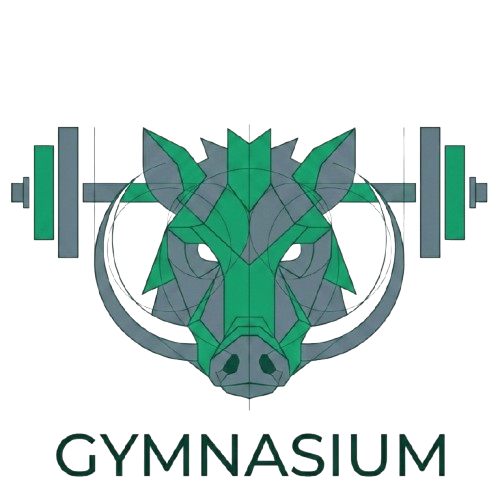

<div align="center">
  
</div>

# Gymnasium

App web per il tracking degli allenamenti in palestra, costruita con **Leptos** (Rust → WebAssembly), **Tailwind CSS 4** e **DaisyUI 5**.
 
## Caratteristiche

- 📝 **Sessioni di allenamento** — registra serie, carichi e ripetizioni per ogni esercizio
- 📊 **Grafici di progressione** — visualizza l'andamento dei carichi nel tempo
- 📅 **Calendario** — panoramica delle sedute per data
- 📜 **Storico** — cronologia completa degli allenamenti passati
- 🏋️ **Programma Trenino inVictus** — schema a 4 giorni preconfigurato con progressione a blocchi
- 💾 **Dati locali** — tutto salvato nel `localStorage` del browser, nessun backend
- 📱 **Mobile-first** — interfaccia ottimizzata per smartphone
- 🔄 **Import/Export JSON** — backup e ripristino dei dati

## Stack tecnologico

| Componente | Tecnologia |
|---|---|
| Framework UI | [Leptos 0.8](https://leptos.dev) (CSR) |
| Compilazione WASM | [Trunk](https://trunk-rs.github.io/trunk/) |
| Stili | [Tailwind CSS 4](https://tailwindcss.com) + [DaisyUI 5](https://daisyui.com) |
| Persistenza | `localStorage` via [gloo-storage](https://github.com/gloo-rs/gloo) |
| Linguaggio | Rust (edition 2024) |

## Prerequisiti

- [Rust](https://www.rust-lang.org/tools/install) (toolchain nightly)
- Target `wasm32-unknown-unknown`
- [Trunk](https://trunk-rs.github.io/trunk/)
- [Node.js](https://nodejs.org/) (per Tailwind CSS)

```sh
# Installa Trunk
cargo install trunk

# Aggiungi il target WASM
rustup target add wasm32-unknown-unknown
```

## Installazione

```sh
git clone https://github.com/tuo-utente/gymnasium-rs.git
cd gymnasium-rs
npm install
```

## Sviluppo

```sh
trunk serve --port 3000 --open
```

L'app si apre su `http://localhost:3000`. Le modifiche ai file `src/`, `style/input.css` e `index.html` attivano il hot-reload automatico.

## Build di produzione

```sh
trunk build --release
```

L'output va nella cartella `dist/`, pronto per il deploy su qualsiasi hosting statico (GitHub Pages, Netlify, Vercel, ecc.).

## Struttura del progetto

```
src/
├── main.rs              # Entry point
├── lib.rs               # Root component e routing
├── state.rs             # Stato globale e serializzazione
├── components/
│   ├── chart.rs         # Grafici di progressione
│   ├── dock.rs          # Barra di navigazione inferiore
│   ├── exercise_card.rs # Card esercizio nella sessione
│   ├── icons.rs         # Icone SVG inline
│   ├── keypad.rs        # Keypad numerico personalizzato
│   ├── modals.rs        # Modali (conferma, dettagli)
│   ├── set_row.rs       # Riga singola serie
│   ├── toast.rs         # Notifiche toast
│   └── ui.rs            # Componenti UI riutilizzabili
├── pages/
│   ├── home.rs          # Pagina principale (sessione attiva)
│   ├── workout.rs       # Svolgimento allenamento
│   ├── calendar.rs      # Vista calendario
│   ├── history.rs       # Storico sedute
│   ├── trenino.rs       # Configurazione programma
│   └── settings.rs      # Impostazioni
style/
├── input.css            # Sorgente Tailwind CSS
└── output.css           # Output generato (gitignored)
```

## Licenza

Questo progetto è distribuito sotto licenza MIT. Vedi il file [LICENSE](LICENSE) per i dettagli.
